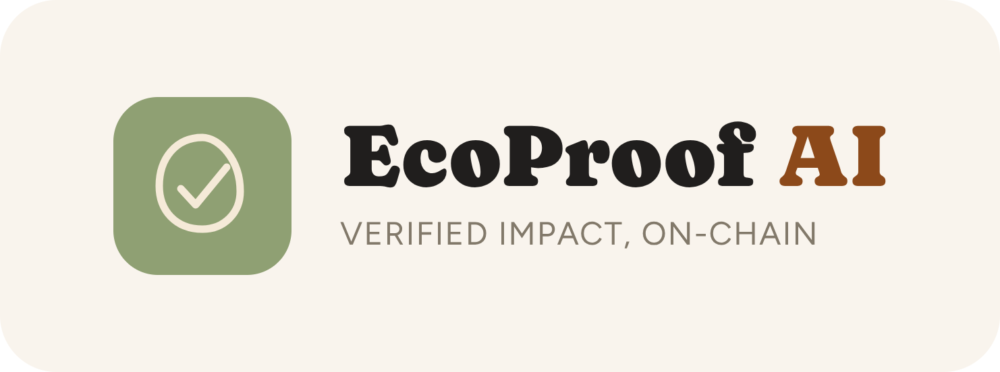

<p align="center">
  
</p>

# 🌱 EcoProof AI

**Scan → collect → unlock.** EcoProof gives sustainable shops, cafés, markets and online brands a way to turn real eco-friendly visits and purchases into shareable, verified social proof. A customer taps a link or scans a QR code and collects a **stamp** in their eco passport. Collect enough stamps and a **soulbound Eco Warrior NFT** unlocks. Every valid claim is anchored on **Solana**.

> Status: hackathon build on **Solana devnet**. Impact figures are estimates (see [Honest limits](#honest-limits)).

## The idea

Sustainable brands have no cheap way to show that real people really chose them, and customers have nothing to show for sustainable habits. EcoProof sits between the two:

- **Customers** get an eco passport: a collection of stamps, streaks, and collectible NFTs that level up (Seedling → Sprout → Guardian → Legend). It's a travel passport crossed with a collectible-card game, and it's built to be shared.
- **Brands** get new customers through that sharing, and a verified record that doesn't depend on trusting their own database.

Underneath, every claim writes a proof on Solana: a hash of the claim plus a claim account that makes "one scan, one stamp" enforceable on-chain.

## How it works

### Places
Everything is a **place**: a shop, a café, a market stall, an online shop. A place has a name, a stamp (its logo, or a generated badge), a one-line tagline, and its own QR. We set up launch partners ourselves; owners can also **self-serve** at `/join` (sign in with a wallet, add name, logo and tagline, get a QR and a print-ready counter card).

### Three claim doors, one destination
Each produces one stamp and one Solana proof.

| Door | Use it for | What it proves |
|---|---|---|
| **Place QR / link** (`/c/<place>`) | A counter display at a café, shop or stall | Someone was scanning that code. Once per day per person per place. Physical places set up through `/join` always get a GPS check (150 m). |
| **Printed card** (`/k/<code>`) | A card dropped into a parcel, on any channel (Amazon, Lazada, Shopee, own shop). The app generates the cards; the shop needs no code. | One card, one stamp, once. A generic stamp with **no impact number**, because a card doesn't prove what was bought. |
| **Verified order** (`/o/<place>/<order>.<sig>`) | WooCommerce shops | A real completed order. A signed QR/link in the order-completed email carries the order, so the stamp shows its **real impact line**. Only this door proves the order happened. |

Online shops have no map pin and no GPS check, and choose door 2, door 3, or both, in `/join`.

### Two classes of stamp, one passport
- **Verified purchase** (the WooCommerce order door): a real order, so the stamp carries the order's real impact line. Premium look, worth **5 points**.
- **Presence** (a place QR or a parcel card): "I was here", no impact number, plainer look, worth **1 point**.

The values are two constants in `lib/stampClasses.ts` (`POINTS_VERIFIED`, `POINTS_PRESENCE`), so the ratio can change with one edit. Both classes write a Solana proof.

### Milestones and NFTs
Milestones count **points**, not scans. Every claim writes a proof; only milestones mint. A **soulbound compressed NFT** (Metaplex Bubblegum V2, made non-transferable) is minted to the customer's wallet at **1, 3, 10 and 25 points, then every 50** (so one verified purchase reaches the first two ranks at once). The artwork is code-drawn SVG with a different look per tier, so it visibly levels up. Customers who haven't connected a wallet yet get the NFT when they do.

### Proofs on Solana
For each claim, EcoProof hashes the record (SHA-256) and writes `ecoproof:v1:<hash>` to Solana as a Memo transaction, in the same transaction that creates a **claim account** derived from the claim's fingerprint (place + person + day, or card code, or order id). Solana refuses to create an account that already exists, so a repeat claim fails on-chain without a custom program. Each proof has a **Verify on-chain** button that recomputes the hash from the stored data and compares it with the memo.

### The passport (the hero screen)
Frosted-glass panels over an earthy green gradient with a honey-gold accent: earned Eco Warrior NFTs shown as their real artwork (highest tier largest, linking to Solana Explorer), the stamp collection (earned bright, not-yet-earned as dashed placeholders), a progress line to the next milestone, and the proof trail. A share button produces a polished image (NFT + stamps + numbers) with a link back to the live passport.

### The map
Only places that have actually joined EcoProof are shown. "Verified" here means **claimed and set up on EcoProof**; independent vetting is on the roadmap.

## Stack

Next.js 16 (App Router) · React · Tailwind · Solana (`@solana/web3.js`, devnet) · Metaplex Bubblegum V2 + MPL-Core · PostgreSQL (Neon) · `next/og` · `qrcode` · Anthropic Claude (classifying products the catalogue doesn't know) · Vercel

## Honest limits

- **Impact numbers are estimates** from a hand-built factor table (`lib/impact.ts`), not audited lifecycle data. A shop can have its own hand-mapped product catalogue (the first connected shop does); for other shops, unknown product names are classified by an AI and are marked as estimates.
- **Only the verified-order door proves a purchase.** QR and card stamps are generic stamps. A chain proof shows a record wasn't altered after creation, not that someone bought something.
- **GPS checks can be spoofed.** They stop casual abuse, not a determined cheater.
- **Self-serve places are not vetted** beyond format limits and three places per owner. The map says so.
- **Devnet only.** NFTs on devnet may not appear in wallets that don't index it; the passport page and Solana Explorer always show them.
- The old receipt-photo flow and the receipt-gated review flow were removed in the pivot. The review gating logic is kept in `lib/reviewGate.ts` and is paused until it is pointed at stamps.

## Project layout

```
app/about/page.tsx            "How EcoProof works": the guide for customers and shops (linked from the passport and the bottom nav)
app/page.tsx                  passport home (splash, hero NFTs, stamps, progress, proof trail)
app/u/[id]/page.tsx           public read-only passport (the link a shared image points to)
app/c/[id]/page.tsx           place QR claim page          app/k/[code]/page.tsx   printed card claim page
app/o/[place]/[token]/page.tsx  verified-order claim page   app/map/page.tsx        joined places map
app/join/page.tsx             self-serve place setup (+ online shop options)
app/place/[id]/page.tsx       print-ready counter card     app/place/[id]/cards    print sheet for card batches
app/api/claims                one endpoint for all three doors (streams live progress as NDJSON)
app/api/woo/webhook/[place]   WooCommerce webhook ingest   app/api/woo/qr          QR image for the order email
app/api/passport-card/[id]    share image of a passport    app/api/card/[id]       share image of one stamp
app/api/verify/[id]           recompute hash, compare to the on-chain memo
lib/stamp.ts                  the single claim function (checks, proof, record)
lib/cards.ts · lib/woo.ts     printed-card and verified-order doors
lib/milestones.ts · lib/nft.ts · lib/milestoneRules.ts · lib/nftArt.ts   milestones, minting, tier art
lib/claim.ts · lib/solana.ts · lib/verify.ts   Solana proofs and verification
lib/passport.ts · lib/impact.ts · lib/order.ts · lib/proof.ts
lib/reviewGate.ts             review gating, proof source pluggable (paused)
scripts/nft-setup.ts          one-time: creates the Merkle tree and the NFT collection
docs/woocommerce/             shop connection guide and a local staging recipe
```

## Run locally

```bash
npm install
cp .env.example .env.local   # fill in the values
npm run dev                  # http://localhost:3000
```

| Variable | Purpose |
|---|---|
| `DATABASE_URL` | Postgres connection string (Neon, or local Docker). Tables and the demo places are created automatically. |
| `SOLANA_SECRET_KEY` | Base58 secret key of a **devnet** wallet that pays for proofs and NFT mints. Locally a key is generated in `.payer.json` if unset. It needs devnet SOL (faucet.solana.com). |
| `SOLANA_RPC_URL` | Optional, defaults to public devnet. |
| `NFT_TREE_ADDRESS`, `NFT_COLLECTION_ADDRESS` | Output of `npx tsx scripts/nft-setup.ts` (run once, with the same wallet as `SOLANA_SECRET_KEY`). Without them stamps still work, NFTs stay pending. |
| `APP_URL` | Public base URL. It goes into NFT metadata and claim links, so set it wherever the app is public. |
| `SESSION_SECRET` | 32+ characters, signs wallet-sign-in sessions (required in production). |
| `ADMIN_TOKEN` | Enables our own place setup and card generation endpoints (`x-admin-token` header). Leave unset to disable them. |
| `ANTHROPIC_API_KEY` | Classifies products the catalogue doesn't know. Optional: without it unknown products count as "not sustainable". |

Local Postgres: `docker run -d -e POSTGRES_PASSWORD=pg -e POSTGRES_DB=ecoproof -p 5433:5432 postgres:16-alpine`, then `DATABASE_URL=postgres://postgres:pg@localhost:5433/ecoproof`.

## Connecting a WooCommerce shop

See [docs/woocommerce/README.md](./docs/woocommerce/README.md) (webhook + a snippet that adds the QR to the order-completed email only) [STAGING.md](./docs/woocommerce/STAGING.md) (a local throw-away shop for testing before anything touches a live one) and [SUPERBEE_ROLLOUT.md](./docs/woocommerce/SUPERBEE_ROLLOUT.md) (the plan for connecting SuperBee).

## More

Submission text and the demo script are in [SUBMISSION.md](./SUBMISSION.md).
